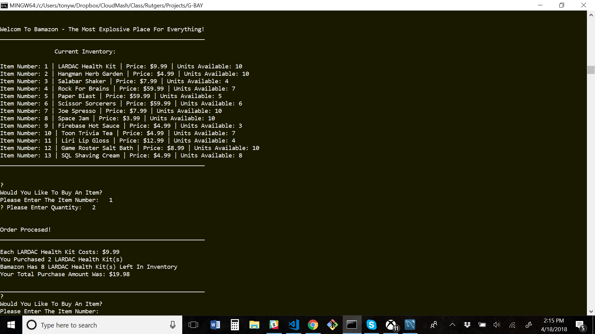

# G-BAY
G-BAY is a back-end database application that lets users buy, sell, and manage items through Node JS, MySQL, and the Command Line Interface (a proxy for the front-end). This application uses the dotenv NPM to secure SQL credentials and masks fields to prevent SQL Injection.  This app also includes financial tools to track sales and profits by operating unit.  

**Video Demo** - https://youtu.be/mkKY-PP0d9E

## Key Features
* Display All Product Inventory & Pricing
* Verify Stock Quantities Before Purchase
* Update Financial/Sales Records After Purchase
* Sync Product Sales To Department Level Sales
* Display All Financial Records By Department
* Calculate Department Profitability Via Product Sales
* Find Products That Are Running Low On Stock 
* Add New Quantities To Existing Product
* Add New Products & Initial Stock Quantities
* Add New Departments
* Sell Products

### NPM Packages
* console.table
* dotenv
* inquirer
* mysql 

# Instructions - For Local Use
1. Install Node JS on your local machine
2. Copy the G-BAY folder and all its files to your local machine
3. Install required packages by typing "NPM Install" in Bash from the application's root directory
4. Set up your SQL database
    1. Paste and run the code from schema.sql into your SQL workbench
    2. Paste and run the code from seed-data.sql into your SQL workbench (optional)
    3. Create a .env file in the root path of the application to store your SQL credentials as shown below
5. Run the corresponding commands from your Bash terminal
    * "node bamazonCustomer.js" - to run the customer-facing functions 
    * "node bamazonManager.js" - to run the manager level functions
    * "node bamazonSupervisor.js" - to run the supervisor functions
6. Follow the written prompts

## Example Setup For .env
Save The following two lines in a .env file:
* SQL_KEY={your password here}
* SQL_DB={your database name}

## Screenshot

